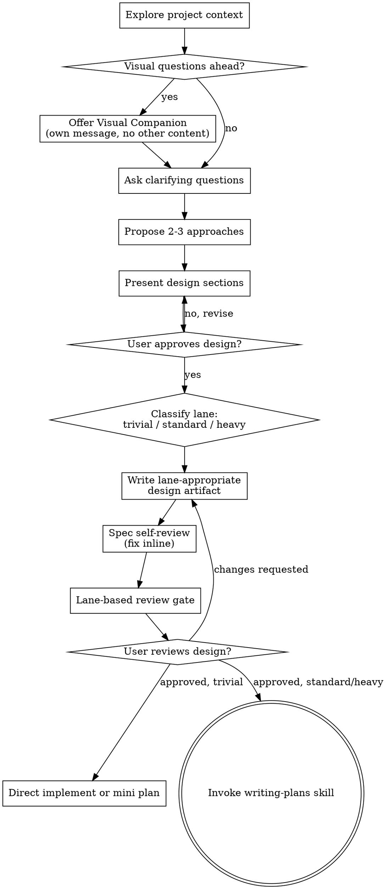

# Brainstorming Ideas Into Designs

Help turn ideas into fully formed designs and specs through natural collaborative dialogue.

Start by understanding the current project context, then ask questions one at a time to refine the idea. Once you understand what you're building, present the design and get user approval.

<HARD-GATE>
Do NOT invoke any implementation skill, write any code, scaffold any project, or take any implementation action until you have presented a design and the user has approved it. This applies to EVERY project regardless of perceived simplicity.
</HARD-GATE>

## Anti-Pattern: "This Is Too Simple To Need A Design"

Every project still needs design acknowledgement. A todo list, a single-function utility, a config change — all of them. But the **ceremony scales by complexity**:

- **Trivial:** short design acknowledgement is enough
- **Standard:** short written design / handoff
- **Heavy:** full written spec + independent review

"Simple" projects are where unexamined assumptions cause wasted work. The design can be very short, but you MUST present it and get approval.

## Complexity Lanes

Classify the task before deciding how much ceremony it needs:

- **Trivial** — copy tweaks, narrow UI polish, one-screen layout nudges, or one/two-file low-risk fixes with no meaningful business-rule / state / architecture impact
- **Standard** — bounded feature adjustments, small multi-file work, or low-risk behavior changes that still benefit from written steps
- **Heavy** — new features, cross-module work, state / data-flow changes, architecture-sensitive work, or broad/high-risk diffs

**Escalation rule:** if a task shows **any signal from a higher lane**, upgrade it to that higher lane.

## Checklist

You MUST create a task for each of these items and complete them in order:

1. **Explore project context** — check files, docs, recent commits
2. **Offer visual companion** (if topic will involve visual questions) — this is its own message, not combined with a clarifying question. See the Visual Companion section below.
3. **Ask clarifying questions** — one at a time, understand purpose/constraints/success criteria
4. **Propose 2-3 approaches** — with trade-offs and your recommendation
5. **Present design** — in sections scaled to their complexity, get user approval after each section
6. **Classify the task lane** — trivial / standard / heavy
7. **Write the design artifact appropriate to the lane**
   - **Trivial:** short design acknowledgement in chat; optional short note if helpful
   - **Standard:** short written design / handoff note
   - **Heavy:** full design spec saved to `docs/superpowers/specs/YYYY-MM-DD-<topic>-design.md`
8. **Spec quality gate** — self-review first, then lane-based review:
   - **Trivial:** reviewer subagent off by default; do one careful local review
   - **Standard:** independent spec reviewer is off by default, because standard work should not pass through both spec review and plan review by default
   - **Heavy:** independent reviewer is the default gate; if the harness requires explicit authorization before spawning subagents, ask for it as a runtime exception rather than a project-policy default
9. **User reviews the design artifact** — if there is a written note/spec, ask the user to review it; if the task stayed trivial and inline, get confirmation on the short design acknowledgement
10. **Transition to implementation**
   - **Trivial:** implement directly or invoke writing-plans for a mini plan
   - **Standard / Heavy:** invoke writing-plans

## Process Flow

**Terminal states:** trivial work may go straight to implementation or a mini plan; standard/heavy work transition to writing-plans. Do NOT invoke frontend-design, mcp-builder, or any other implementation skill directly from brainstorming.

## The Process

**Understanding the idea:**

- Check out the current project state first (files, docs, recent commits)
- Before asking detailed questions, assess scope: if the request describes multiple independent subsystems (e.g., "build a platform with chat, file storage, billing, and analytics"), flag this immediately. Don't spend questions refining details of a project that needs to be decomposed first.
- If the project is too large for a single spec, help the user decompose into sub-projects: what are the independent pieces, how do they relate, what order should they be built? Then brainstorm the first sub-project through the normal design flow. Each sub-project gets its own spec → plan → implementation cycle.
- For appropriately-scoped projects, ask questions one at a time to refine the idea
- Prefer multiple choice questions when possible, but open-ended is fine too
- Only one question per message - if a topic needs more exploration, break it into multiple questions
- Focus on understanding: purpose, constraints, success criteria

**Exploring approaches:**

- Propose 2-3 different approaches with trade-offs
- Present options conversationally with your recommendation and reasoning
- Lead with your recommended option and explain why

**Presenting the design:**

- Once you believe you understand what you're building, present the design
- Scale each section to its complexity: a few sentences if straightforward, up to 200-300 words if nuanced
- Ask after each section whether it looks right so far
- Cover: architecture, components, data flow, error handling, testing
- Be ready to go back and clarify if something doesn't make sense

**Design for isolation and clarity:**

- Break the system into smaller units that each have one clear purpose, communicate through well-defined interfaces, and can be understood and tested independently
- For each unit, you should be able to answer: what does it do, how do you use it, and what does it depend on?
- Can someone understand what a unit does without reading its internals? Can you change the internals without breaking consumers? If not, the boundaries need work.
- Smaller, well-bounded units are also easier for you to work with - you reason better about code you can hold in context at once, and your edits are more reliable when files are focused. When a file grows large, that's often a signal that it's doing too much.

**Working in existing codebases:**

- Explore the current structure before proposing changes. Follow existing patterns.
- Where existing code has problems that affect the work (e.g., a file that's grown too large, unclear boundaries, tangled responsibilities), include targeted improvements as part of the design - the way a good developer improves code they're working in.
- Don't propose unrelated refactoring. Stay focused on what serves the current goal.

## After the Design

**Documentation by lane:**

- **Trivial:** short design acknowledgement in chat is enough by default; a written note is optional
- **Standard:** write a short design note if the handoff benefits from it
- **Heavy:** write the validated design (spec) to `docs/superpowers/specs/YYYY-MM-DD-<topic>-design.md`
  - (User preferences for spec location override this default)
- Use elements-of-style:writing-clearly-and-concisely skill if available
- If you create a design document, keep it scoped to the approved work

**Spec Self-Review:**
After writing the lane-appropriate design artifact, look at it with fresh eyes:

1. **Placeholder scan:** Any "TBD", "TODO", incomplete sections, or vague requirements? Fix them.
2. **Internal consistency:** Do any sections contradict each other? Does the architecture match the feature descriptions?
3. **Scope check:** Is this focused enough for a single implementation plan, or does it need decomposition?
4. **Ambiguity check:** Could any requirement be interpreted two different ways? If so, pick one and make it explicit.

Fix any issues inline before moving to the lane-based review decision.

**Spec Review Gate:**
After the self-review:

1. If **Trivial**:
   - reviewer subagent is off by default
   - do one careful local review
   - if the task grows in scope, upgrade the lane instead of forcing it through the trivial path
2. If **Standard**:
   - independent spec reviewer is normally skipped
   - rely on self-review here, then use `writing-plans` as the single default document-review layer
   - if the standard task looks unusually risky, you may still run a spec reviewer, but that is an exception rather than the default
3. If **Heavy**, independent reviewer pass is the default:
   - Dispatch spec-document-reviewer subagent (see spec-document-reviewer-prompt.md)
   - If the harness requires explicit authorization before spawning subagents, ask the user for that authorization instead of silently skipping the reviewer; treat that as a runtime exception, not project policy
   - If the user declines that reviewer authorization, stop and ask whether they want to proceed with the independent reviewer gate explicitly skipped for this heavy task
   - If Issues Found: fix, re-dispatch, repeat until Approved
   - If loop exceeds 3 iterations, surface to human for guidance
4. Never pretend a local review is equivalent to an independent reviewer pass

**User Review Gate:**
After the review gate passes:

- **Trivial:** ask the user to confirm the short design summary before implementing
- **Standard / Heavy with written artifact:** ask the user to review the written note/spec before proceeding
- If they request changes, make them and re-run the appropriate self-review / review loop

**Implementation:**

- Ask: "Ready to set up for implementation?"
- If the current workspace has lots of unrelated changes or the user requests isolation, use superpowers:using-git-worktrees; otherwise stay in the current workspace
- **Trivial:** implement directly or invoke writing-plans for a mini plan if written steps would help
- **Standard / Heavy:** invoke the writing-plans skill
- Do NOT jump straight from brainstorming to another implementation skill.

## Key Principles

- **One question at a time** - Don't overwhelm with multiple questions
- **Multiple choice preferred** - Easier to answer than open-ended when possible
- **YAGNI ruthlessly** - Remove unnecessary features from all designs
- **Explore alternatives** - Always propose 2-3 approaches before settling
- **Incremental validation** - Present design, get approval before moving on
- **Be flexible** - Go back and clarify when something doesn't make sense

## Visual Companion

A browser-based companion for showing mockups, diagrams, and visual options during brainstorming. Available as a tool — not a mode. Accepting the companion means it's available for questions that benefit from visual treatment; it does NOT mean every question goes through the browser.

**Offering the companion:** When you anticipate that upcoming questions will involve visual content (mockups, layouts, diagrams), offer it once for consent:
> "Some of what we're working on might be easier to explain if I can show it to you in a web browser. I can put together mockups, diagrams, comparisons, and other visuals as we go. This feature is still new and can be token-intensive. Want to try it? (Requires opening a local URL)"

**This offer MUST be its own message.** Do not combine it with clarifying questions, context summaries, or any other content. The message should contain ONLY the offer above and nothing else. Wait for the user's response before continuing. If they decline, proceed with text-only brainstorming.

**Per-question decision:** Even after the user accepts, decide FOR EACH QUESTION whether to use the browser or the terminal. The test: **would the user understand this better by seeing it than reading it?**

- **Use the browser** for content that IS visual — mockups, wireframes, layout comparisons, architecture diagrams, side-by-side visual designs
- **Use the terminal** for content that is text — requirements questions, conceptual choices, tradeoff lists, A/B/C/D text options, scope decisions

A question about a UI topic is not automatically a visual question. "What does personality mean in this context?" is a conceptual question — use the terminal. "Which wizard layout works better?" is a visual question — use the browser.

If they agree to the companion, read the detailed guide before proceeding:
`skills/brainstorming/visual-companion.md`
