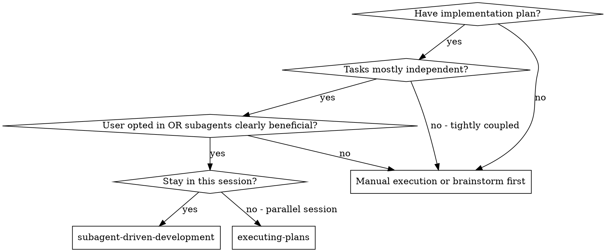
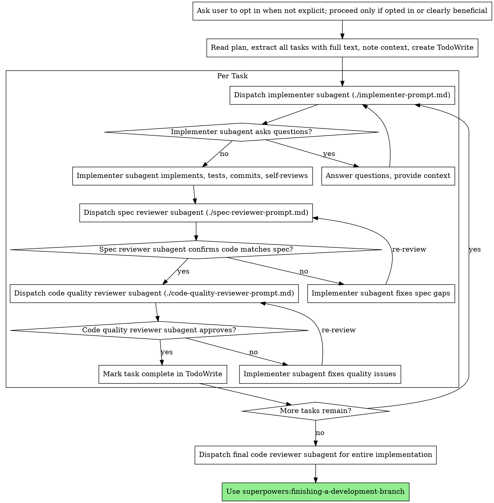

# Subagent-Driven Development

Execute a plan with subagents only when the user opts in or the task clearly benefits from subagents; otherwise fall back to manual execution or executing-plans.

**Why subagents:** You delegate tasks to specialized agents with isolated context. By precisely crafting their instructions and context, you ensure they stay focused and succeed at their task. They should never inherit your session's context or history — you construct exactly what they need. This also preserves your own context for coordination work.

**Core principle:** When using subagents, use a fresh subagent per task and a two-stage review (spec then quality). Fresh subagent per task + two-stage review = high quality, fast iteration.

**Reviewer rule:** Reviewer subagents are leaf nodes. When dispatching any reviewer (spec, code quality, final review), explicitly instruct it to perform the review directly, not call or delegate to any other subagent, not discuss tool/platform limits, and return conclusions only from the provided scope plus code it reads itself.

**Lane interaction:** this skill is usually the best fit for **standard** and **heavy** work. **Trivial** work normally stays manual unless the user explicitly wants subagents anyway.

**Policy boundary:** reviewer subagents are default-allowed for document review and code review. The opt-in / clear-benefit gate mainly applies to implementation workers, not to reviewer agents.

## When to Use



**vs. Executing Plans (parallel session):**
- Same session (no context switch)
- Fresh subagent per task (no context pollution)
- Two-stage review after each task: spec compliance first, then code quality
- Faster iteration (no human-in-loop between tasks)

## Codex Agent Lifecycle

This skill is cross-platform, but in Codex the controller should map subagent orchestration to the native agent lifecycle tools:

- record each spawned subagent as `{ agent_id, target }`
- when blocked on a subagent result, use `wait_agent`
- if multiple subagents are active, maintain a `pending` set / map and wait on that set
- after integrating a finished subagent's output, call `close_agent` unless you know you will reuse it immediately

Do **not** use shell waits, background command polling, or other non-agent waiting patterns as a substitute for subagent completion.

## The Process



## Model Selection

Use the least powerful model and reasoning effort that can handle each role while preserving correctness.

**Exploration and simple tasks** (repo lookup, bounded investigation, log inspection, simple scoped edits): use `gpt-5.3-codex` with `medium` reasoning by default. Use `low` when the task is mechanical and low risk.

**Medium tasks** (focused implementation, targeted review, integration with known patterns): use `gpt-5.5` with `low` reasoning.

**Advanced tasks** (architecture, broad code review, complex debugging, high-risk implementation, multi-file coordination): use `gpt-5.5` with `medium` reasoning.

Escalate GPT-5.5 to `high` or `xhigh` only when the task is unusually hard and the extra latency/cost is justified by risk, failed lower-effort attempts, or explicit user direction.

**Task complexity signals:**
- Touches 1-2 files with a complete spec -> `gpt-5.3-codex` or `gpt-5.5` low
- Touches multiple files with integration concerns -> `gpt-5.5` low or medium
- Requires design judgment or broad codebase understanding -> `gpt-5.5` medium or higher

## Handling Implementer Status

Implementer subagents report one of four statuses. Handle each appropriately:

**DONE:** Proceed to spec compliance review.

**DONE_WITH_CONCERNS:** The implementer completed the work but flagged doubts. Read the concerns before proceeding. If the concerns are about correctness or scope, address them before review. If they're observations (e.g., "this file is getting large"), note them and proceed to review.

**NEEDS_CONTEXT:** The implementer needs information that wasn't provided. Provide the missing context and re-dispatch.

**BLOCKED:** The implementer cannot complete the task. Assess the blocker:
1. If it's a context problem, provide more context and re-dispatch with the same model
2. If the task requires more reasoning, re-dispatch with a more capable model
3. If the task is too large, break it into smaller pieces
4. If the plan itself is wrong, escalate to the human

**Never** ignore an escalation or force the same model to retry without changes. If the implementer said it's stuck, something needs to change.

## Prompt Templates

- `./implementer-prompt.md` - Dispatch implementer subagent
- `./spec-reviewer-prompt.md` - Dispatch spec compliance reviewer subagent
- `./code-quality-reviewer-prompt.md` - Dispatch code quality reviewer subagent

Always keep reviewer dispatches under a hard boundary:
- The reviewer is the direct review agent for that request
- It must not call, delegate, or suggest any other subagent or nested review
- It must not discuss tool limitations or platform limitations
- It must review only against the provided requirements, file scope, diff / SHA range, and code it directly inspects
- If context is incomplete, it should state the missing inputs and still give the best review possible from the available evidence

## Example Workflow

```
You: This plan could benefit from subagents. Do you want me to use them, or proceed manually?

[Read plan file once: docs/superpowers/plans/feature-plan.md]
[Extract all 5 tasks with full text and context]
[Create TodoWrite with all tasks]

Task 1: Hook installation script

[Get Task 1 text and context (already extracted)]
[Dispatch implementation subagent with full task text + context]

Implementer: "Before I begin - should the hook be installed at user or system level?"

You: "User level (~/.config/superpowers/hooks/)"

Implementer: "Got it. Implementing now..."
[Later] Implementer:
  - Implemented install-hook command
  - Added tests, 5/5 passing
  - Self-review: Found I missed --force flag, added it
  - Committed

[Dispatch spec compliance reviewer]
Spec reviewer: ✅ Spec compliant - all requirements met, nothing extra

[Get git SHAs, dispatch code quality reviewer]
Code reviewer: Strengths: Good test coverage, clean. Issues: None. Approved.

[Mark Task 1 complete]

Task 2: Recovery modes

[Get Task 2 text and context (already extracted)]
[Dispatch implementation subagent with full task text + context]

Implementer: [No questions, proceeds]
Implementer:
  - Added verify/repair modes
  - 8/8 tests passing
  - Self-review: All good
  - Committed

[Dispatch spec compliance reviewer]
Spec reviewer: ❌ Issues:
  - Missing: Progress reporting (spec says "report every 100 items")
  - Extra: Added --json flag (not requested)

[Implementer fixes issues]
Implementer: Removed --json flag, added progress reporting

[Spec reviewer reviews again]
Spec reviewer: ✅ Spec compliant now

[Dispatch code quality reviewer]
Code reviewer: Strengths: Solid. Issues (Important): Magic number (100)

[Implementer fixes]
Implementer: Extracted PROGRESS_INTERVAL constant

[Code reviewer reviews again]
Code reviewer: ✅ Approved

[Mark Task 2 complete]

...

[After all tasks]
[Dispatch final code-reviewer]
Final reviewer: All requirements met, ready to merge

Done!
```

## Advantages

**vs. Manual execution:**
- Subagents follow TDD naturally
- Fresh context per task (no confusion)
- Parallel-safe (subagents don't interfere)
- Subagent can ask questions (before AND during work)

**vs. Executing Plans:**
- Same session (no handoff)
- Continuous progress (no waiting)
- Review checkpoints automatic

**Efficiency gains:**
- No file reading overhead (controller provides full text)
- Controller curates exactly what context is needed
- Subagent gets complete information upfront
- Questions surfaced before work begins (not after)

**Quality gates:**
- Self-review catches issues before handoff
- Two-stage review: spec compliance, then code quality
- Review loops ensure fixes actually work
- Spec compliance prevents over/under-building
- Code quality ensures implementation is well-built

**Cost:**
- More subagent invocations (implementer + 2 reviewers per task)
- Controller does more prep work (extracting all tasks upfront)
- Review loops add iterations
- But catches issues early (cheaper than debugging later)

## Red Flags

**Never:**
- Default to subagents without user consent or clear efficiency gains
- Start implementation on main/master branch without explicit user consent
- Skip reviews (spec compliance OR code quality)
- Proceed with unfixed issues
- Dispatch multiple implementation subagents in parallel (conflicts)
- In Codex, substitute shell/background waits for `wait_agent`
- In Codex, leave completed agents open when their results are already integrated
- Make subagent read plan file (provide full text instead)
- Skip scene-setting context (subagent needs to understand where task fits)
- Ignore subagent questions (answer before letting them proceed)
- Accept "close enough" on spec compliance (spec reviewer found issues = not done)
- Skip review loops (reviewer found issues = implementer fixes = review again)
- Let implementer self-review replace actual review (both are needed)
- **Start code quality review before spec compliance is ✅** (wrong order)
- Move to next task while either review has open issues
- Let a reviewer subagent spawn, delegate to, or suggest another reviewer / subagent
- Let a reviewer turn missing context into nested review or tool-limit discussion instead of a direct review result

**If subagent asks questions:**
- Answer clearly and completely
- Provide additional context if needed
- Don't rush them into implementation

**If reviewer finds issues:**
- Implementer (same subagent) fixes them
- Reviewer reviews again
- Repeat until approved
- Don't skip the re-review

**If subagent fails task:**
- Dispatch fix subagent with specific instructions
- Don't try to fix manually (context pollution)

## Integration

**Required workflow skills:**
- **superpowers:using-git-worktrees** - OPTIONAL: Use only when isolation is needed
- **superpowers:writing-plans** - Creates the plan this skill executes
- **superpowers:requesting-code-review** - Code review template for reviewer subagents
- **superpowers:finishing-a-development-branch** - Complete development after all tasks

**Subagents should use:**
- **superpowers:test-driven-development** - Subagents follow TDD for each task

**Alternative workflow:**
- **superpowers:executing-plans** - Use for parallel session instead of same-session execution
