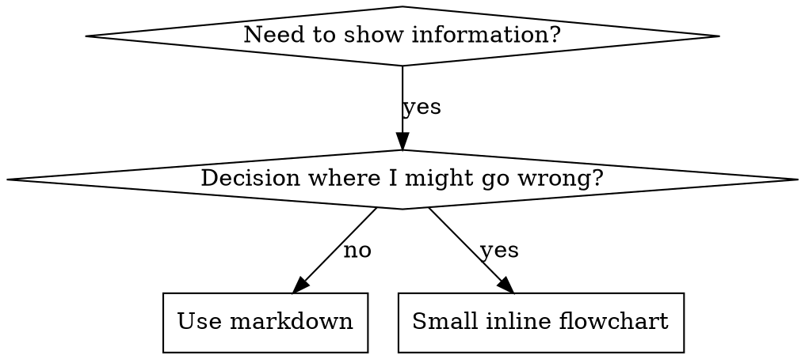

# Writing Skills

## Overview

Writing skills uses evaluation-driven authoring: establish the behavior to
protect, measure the current baseline when useful, make the smallest guidance
change, and verify the resulting behavior.

**Personal skills live in your runtime's skills directory** 

Use pressure scenarios for discipline failures, application scenarios for
techniques, retrieval tests for references, and static checks for structural or
editorial changes.

**Core principle:** Do not manufacture a failure. If an observed trace already
shows the problem, it is valid baseline evidence. If the current behavior is
already correct, use a GREEN regression scenario instead of forcing a failure.

**Quality principle:** A good skill makes agent behavior predictable: the same process every run, even when the output differs.

`test-driven-development` provides useful vocabulary, but skill evaluation has
its own lanes and does not require a literal failing RED for every edit.

**Official guidance:** For Anthropic's official skill authoring best practices, see anthropic-best-practices.md. This document provides additional patterns and guidelines that complement the TDD-focused approach in this skill.

## What is a Skill?

A **skill** is a reference guide for proven techniques, patterns, or tools. Skills help future agents find and apply effective approaches.

**Skills are:** Reusable techniques, patterns, tools, reference guides

**Skills are NOT:** Narratives about how you solved a problem once

## Evaluation mapping for skills

| TDD Concept | Skill Creation |
|-------------|----------------|
| **Test case** | Pressure scenario with subagent |
| **Production code** | Skill document (SKILL.md) |
| **Test fails (RED)** | Agent violates rule without skill (baseline) |
| **Test passes (GREEN)** | Agent complies with skill present |
| **Refactor** | Close loopholes while maintaining compliance |
| **Write test first** | Run baseline scenario BEFORE writing skill |
| **Watch it fail** | Document exact rationalizations agent uses |
| **Minimal code** | Write skill addressing those specific violations |
| **Watch it pass** | Verify agent now complies |
| **Refactor cycle** | Find new rationalizations → plug → re-verify |

Behavior-changing guidance should have baseline and post-change evidence.
Pure structural/editorial edits may use static validation plus a focused GREEN
regression check.

## When to Create a Skill

**Create when:**
- Technique wasn't intuitively obvious to you
- You'd reference this again across projects
- Pattern applies broadly (not project-specific)
- Others would benefit

**Don't create for:**
- One-off solutions
- Standard practices well-documented elsewhere
- Project-specific conventions (put in your instructions file)
- Mechanical constraints (if it's enforceable with regex/validation, automate it—save documentation for judgment calls)

## Skill Types

### Technique
Concrete method with steps to follow (condition-based-waiting, root-cause-tracing)

### Pattern
Way of thinking about problems (flatten-with-flags, test-invariants)

### Reference
API docs, syntax guides, tool documentation (office docs)

## Directory Structure


```
skills/
  skill-name/
    SKILL.md              # Main reference (required)
    supporting-file.*     # Only if needed
```

**Flat namespace** - all skills in one searchable namespace

**Separate files for:**
1. **Heavy reference** (100+ lines) - API docs, comprehensive syntax
2. **Reusable tools** - Scripts, utilities, templates

**Keep inline:**
- Principles and concepts
- Code patterns (< 50 lines)
- Everything else

## SKILL.md Structure

**Frontmatter (YAML):**
- Two required fields: `name` and `description` (see [agentskills.io/specification](https://agentskills.io/specification) for all supported fields)
- Put skill versions under `metadata.version`; top-level `version` is not part of the Agent Skills specification
- Max 1024 characters total
- `name`: Use letters, numbers, and hyphens only (no parentheses, special chars)
- `description`: Third-person, describes ONLY when to use (NOT what it does)
  - Start with "Use when..." to focus on triggering conditions
  - Include specific symptoms, situations, and contexts
  - **NEVER summarize the skill's process or workflow** (see SDO section for why)
  - Keep under 500 characters if possible

```markdown
---
name: Skill-Name-With-Hyphens
description: Use when [specific triggering conditions and symptoms]
---

# Skill Name

## Overview
What is this? Core principle in 1-2 sentences.

## When to Use
[Small inline flowchart IF decision non-obvious]

Bullet list with SYMPTOMS and use cases
When NOT to use

## Core Pattern (for techniques/patterns)
Before/after code comparison

## Quick Reference
Table or bullets for scanning common operations

## Implementation
Inline code for simple patterns
Link to file for heavy reference or reusable tools

## Common Mistakes
What goes wrong + fixes

## Real-World Impact (optional)
Concrete results
```


## Skill Discovery Optimization (SDO)

**Critical for discovery:** Future agents need to FIND your skill

### 1. Invocation and Description

**Purpose:** Your agent reads the description to decide which skills to load for a given task. Make it answer: "Should I read this skill right now?"

Choose invocation first:

- **Model-invoked:** keep a `description`. The agent can discover it, other skills can reference it, and every turn pays the context load of that description.
- **User-invoked:** set `disable-model-invocation: true`. Only the human can invoke it; the `description` becomes a human-facing summary and does not need `Use when...`.

Use model invocation only when autonomous discovery is valuable. Use user invocation for reference material that the human intentionally asks for.

**For model-invoked skills, Description = When to Use, NOT What the Skill Does.**

The description should describe triggering conditions, symptoms, and leading words. Do NOT summarize the skill's process or workflow.

**Why this matters:** Testing revealed that when a description summarizes the skill's workflow, an agent may follow the description instead of reading the full skill content. A description saying "code review between tasks" caused an agent to do ONE review, even though the skill's flowchart clearly showed TWO reviews (spec compliance then code quality).

When the description was changed to just "Use when executing implementation plans with independent tasks" (no workflow summary), the agent correctly read the flowchart and followed the two-stage review process.

**The trap:** Descriptions that summarize workflow create a shortcut agents will take. The skill body becomes documentation agents skip.

```yaml
# ❌ BAD: Summarizes workflow - agents may follow this instead of reading skill
description: Use when executing plans - dispatches subagent per task with code review between tasks

# ❌ BAD: Too much process detail
description: Use for TDD - write test first, watch it fail, write minimal code, refactor

# ✅ GOOD: Just triggering conditions, no workflow summary
description: Use when executing implementation plans with independent tasks in the current session

# ✅ GOOD: Triggering conditions only
description: Use when implementing any feature or bugfix, before writing implementation code
```

**Model-invoked description content:**
- Use concrete triggers, symptoms, and situations that signal this skill applies
- Front-load the leading word or domain term the user/agent will actually say
- Describe the *problem* (race conditions, inconsistent behavior) not *language-specific symptoms* (setTimeout, sleep)
- Keep triggers technology-agnostic unless the skill itself is technology-specific
- If skill is technology-specific, make that explicit in the trigger
- Write in third person (injected into system prompt)
- One trigger per distinct branch; collapse synonyms that name the same branch
- **NEVER summarize the skill's process or workflow**

```yaml
# ❌ BAD: Too abstract, vague, doesn't include when to use
description: For async testing

# ❌ BAD: First person
description: I can help you with async tests when they're flaky

# ❌ BAD: Mentions technology but skill isn't specific to it
description: Use when tests use setTimeout/sleep and are flaky

# ✅ GOOD: Starts with "Use when", describes problem, no workflow
description: Use when tests have race conditions, timing dependencies, or pass/fail inconsistently

# ✅ GOOD: Technology-specific skill with explicit trigger
description: Use when using React Router and handling authentication redirects
```

### 2. Keyword Coverage

Use words an agent would search for:
- Error messages: "Hook timed out", "ENOTEMPTY", "race condition"
- Symptoms: "flaky", "hanging", "zombie", "pollution"
- Synonyms: "timeout/hang/freeze", "cleanup/teardown/afterEach"
- Tools: Actual commands, library names, file types

### 3. Descriptive Naming

**Use active voice, verb-first:**
- ✅ `creating-skills` not `skill-creation`
- ✅ `condition-based-waiting` not `async-test-helpers`

### 4. Token Efficiency (Critical)

**Problem:** getting-started and frequently-referenced skills load into EVERY conversation. Every token counts.

**Target word counts:**
- getting-started workflows: <150 words each
- Frequently-loaded skills: <200 words total
- Other skills: <500 words (still be concise)

**Techniques:**

**Move details to tool help:**
```bash
# ❌ BAD: Document all flags in SKILL.md
search-conversations supports --text, --both, --after DATE, --before DATE, --limit N

# ✅ GOOD: Reference --help
search-conversations supports multiple modes and filters. Run --help for details.
```

**Use cross-references:**
```markdown
# ❌ BAD: Repeat workflow details
When searching, dispatch subagent with template...
[20 lines of repeated instructions]

# ✅ GOOD: Reference other skill
Always use subagents (50-100x context savings). REQUIRED: Use [other-skill-name] for workflow.
```

**Compress examples:**
```markdown
# ❌ BAD: Verbose example (42 words)
your human partner: "How did we handle authentication errors in React Router before?"
You: I'll search past conversations for React Router authentication patterns.
[Dispatch subagent with search query: "React Router authentication error handling 401"]

# ✅ GOOD: Minimal example (20 words)
Partner: "How did we handle auth errors in React Router?"
You: Searching...
[Dispatch subagent → synthesis]
```

**Eliminate redundancy:**
- Don't repeat what's in cross-referenced skills
- Don't explain what's obvious from command
- Don't include multiple examples of same pattern
- Keep each meaning in one authoritative place; if changing behavior requires editing two spots, the skill has duplication
- Delete no-op sentences that do not change agent behavior versus the default

**Verification:**
```bash
wc -w skills/path/SKILL.md
# getting-started workflows: aim for <150 each
# Other frequently-loaded: aim for <200 total
```

**Name by what you DO or core insight:**
- ✅ `condition-based-waiting` > `async-test-helpers`
- ✅ `using-skills` not `skill-usage`
- ✅ `flatten-with-flags` > `data-structure-refactoring`
- ✅ `root-cause-tracing` > `debugging-techniques`

**Gerunds (-ing) work well for processes:**
- `creating-skills`, `testing-skills`, `debugging-with-logs`
- Active, describes the action you're taking

### 5. Cross-Referencing Other Skills

**When writing documentation that references other skills:**

Use skill name only, with explicit requirement markers:
- ✅ Good: `**REQUIRED SUB-SKILL:** Use superpowers:test-driven-development`
- ✅ Good: `**REQUIRED BACKGROUND:** You MUST understand superpowers:systematic-debugging`
- ❌ Bad: `See skills/testing/test-driven-development` (unclear if required)
- ❌ Bad: `@skills/testing/test-driven-development/SKILL.md` (force-loads, burns context)

**Why no @ links:** `@` syntax force-loads files immediately, consuming 200k+ context before you need them.

## Predictable Skill Design

Use these levers when editing an existing skill or compressing a large one.

### Information Hierarchy

Put content where the agent needs it:

1. **In-skill steps:** ordered actions in `SKILL.md`. Each step ends with a checkable completion criterion.
2. **In-skill reference:** definitions, rules, and caveats every branch needs.
3. **Disclosed reference:** separate files reached by a clear context pointer, for heavy material only some branches need.

A completion criterion should be checkable and, when quality depends on coverage, exhaustive. "Every modified model accounted for" drives better legwork than "produce a change list."

Use progressive disclosure to keep `SKILL.md` legible: inline what every path needs; push branch-specific reference behind a linked file. Keep each concept co-located: definition, rules, caveats, and examples under one heading.

### Granularity

Split a skill only when the split earns its cost:

- **By invocation:** create a separate model-invoked skill only when it has a distinct trigger/leading word worth its own description.
- **By sequence:** split steps when later steps visible in context cause agents to rush the current step.

If many user-invoked reference skills become hard to remember, create one router skill instead of turning all of them model-invoked.

### Leading Words

A leading word is a compact term already in the model's priors that anchors behavior, such as "red" for a failing test or "tracer bullet" for a thin end-to-end slice. Use leading words to replace repeated explanations, and include them in model-invoked descriptions when they are real trigger language.

### Pruning and Failure Modes

Prune sentence by sentence:

- **Duplication:** same meaning in multiple places. Keep one source of truth.
- **Sediment:** stale material that no longer bears on the skill.
- **Sprawl:** too much live material in one `SKILL.md`; disclose reference or split by branch.
- **No-op:** a line that does not change behavior versus the default. Delete it or replace it with a stronger, testable instruction.
- **Premature completion:** a step ends too early. First sharpen the completion criterion; only split the sequence if the criterion is irreducibly fuzzy and the rush is observed.

## Flowchart Usage



**Use flowcharts ONLY for:**
- Non-obvious decision points
- Process loops where you might stop too early
- "When to use A vs B" decisions

**Never use flowcharts for:**
- Reference material → Tables, lists
- Code examples → Markdown blocks
- Linear instructions → Numbered lists
- Labels without semantic meaning (step1, helper2)

See `graphviz-conventions.dot` in this directory for graphviz style rules.

**Visualizing for your human partner:** Use `render-graphs.js` in this directory to render a skill's flowcharts to SVG:
```bash
./render-graphs.js ../some-skill           # Each diagram separately
./render-graphs.js ../some-skill --combine # All diagrams in one SVG
```

## Code Examples

**One excellent example beats many mediocre ones**

Choose most relevant language:
- Testing techniques → TypeScript/JavaScript
- System debugging → Shell/Python
- Data processing → Python

**Good example:**
- Complete and runnable
- Well-commented explaining WHY
- From real scenario
- Shows pattern clearly
- Ready to adapt (not generic template)

**Don't:**
- Implement in 5+ languages
- Create fill-in-the-blank templates
- Write contrived examples

You're good at porting - one great example is enough.

## File Organization

### Self-Contained Skill
```
defense-in-depth/
  SKILL.md    # Everything inline
```
When: All content fits, no heavy reference needed

### Skill with Reusable Tool
```
condition-based-waiting/
  SKILL.md    # Overview + patterns
  example.ts  # Working helpers to adapt
```
When: Tool is reusable code, not just narrative

### Skill with Heavy Reference
```
pptx/
  SKILL.md       # Overview + workflows
  pptxgenjs.md   # 600 lines API reference
  ooxml.md       # 500 lines XML structure
  scripts/       # Executable tools
```
When: Reference material too large for inline

## Skill change gate

```
NO BEHAVIOR-CHANGING SKILL EDIT WITHOUT BASELINE OR REGRESSION EVIDENCE
```

For a measured failure, capture the existing trace or run a baseline scenario.
For new guidance with no natural failing behavior, define the desired scenario
and verify GREEN after the edit. For wording, metadata, links, or formatting that
does not change behavior, run the relevant static validators. Do not delete valid
work merely to recreate ceremony.

## Testing All Skill Types

Different skill types need different test approaches:

### Discipline-Enforcing Skills (rules/requirements)

**Examples:** TDD, verification-before-completion, designing-before-coding

**Test with:**
- Academic questions: Do they understand the rules?
- Pressure scenarios: Do they comply under stress?
- Multiple pressures combined: time + sunk cost + exhaustion
- Identify rationalizations and add explicit counters

**Success criteria:** Agent follows rule under maximum pressure

### Technique Skills (how-to guides)

**Examples:** condition-based-waiting, root-cause-tracing, defensive-programming

**Test with:**
- Application scenarios: Can they apply the technique correctly?
- Variation scenarios: Do they handle edge cases?
- Missing information tests: Do instructions have gaps?

**Success criteria:** Agent successfully applies technique to new scenario

### Pattern Skills (mental models)

**Examples:** reducing-complexity, information-hiding concepts

**Test with:**
- Recognition scenarios: Do they recognize when pattern applies?
- Application scenarios: Can they use the mental model?
- Counter-examples: Do they know when NOT to apply?

**Success criteria:** Agent correctly identifies when/how to apply pattern

### Reference Skills (documentation/APIs)

**Examples:** API documentation, command references, library guides

**Test with:**
- Retrieval scenarios: Can they find the right information?
- Application scenarios: Can they use what they found correctly?
- Gap testing: Are common use cases covered?

**Success criteria:** Agent finds and correctly applies reference information

## Common Rationalizations for Skipping Testing

| Excuse | Reality |
|--------|---------|
| "Skill is obviously clear" | Clear to you ≠ clear to other agents. Test it. |
| "It's just a reference" | References can have gaps, unclear sections. Test retrieval. |
| "Testing is overkill" | Untested skills have issues. Always. 15 min testing saves hours. |
| "I'll test if problems emerge" | Problems = agents can't use skill. Test BEFORE deploying. |
| "Too tedious to test" | Testing is less tedious than debugging bad skill in production. |
| "I'm confident it's good" | Overconfidence guarantees issues. Test anyway. |
| "Academic review is enough" | Reading ≠ using. Test application scenarios. |
| "No time to test" | Deploying untested skill wastes more time fixing it later. |

**All of these mean: Test before deploying. No exceptions.**

## Match the Form to the Failure

Before writing guidance, classify the baseline failure. The form that bulletproofs one failure type measurably backfires on another.

| Baseline failure | Right form | Wrong form |
|---|---|---|
| Skips/violates a rule under pressure (knows better, does it anyway) | Prohibition + rationalization table + red flags (see Bulletproofing below) | Soft guidance ("prefer...", "consider...") |
| Complies, but output has the wrong shape (bloated prompt, buried verdict, restated spec) | Positive recipe or contract: state what the output IS — its parts, in order | Prohibition list ("don't restate", "never narrate") |
| Omits a required element from something they already produce | Structural: REQUIRED field or slot in the template they fill in | Prose reminders near the template |
| Behavior should depend on a condition | Conditional keyed to an observable predicate ("if the brief exists, reference it") | Unconditional rule + exemption clauses |

**Why prohibitions backfire on shaping problems:** under a competing incentive ("make the prompt self-contained"), agents negotiate with "don't X". In head-to-head wording tests on dispatch-prompt guidance, the prohibition arm produced clearly more of the unwanted content than the recipe arm (fully separated distributions), and trended worse than even the no-guidance control — micro-test your own case rather than assuming, but never reach for the prohibition by default. A recipe leaves nothing to negotiate: the output matches the stated shape or it doesn't.

**Rules for whichever form you pick:**
- **No nuance clauses.** "Don't X unless it matters" reopens the negotiation — appending a single nuance clause to a winning recipe degraded it from consistent to noisy in the same wording tests. Express a real exception as its own conditional on an observable predicate.
- **Exemption clauses don't scope.** "This limit doesn't apply to code blocks" still suppresses code blocks. If part of the output must be exempt, restructure so the rule can't reach it.

## Bulletproofing Skills Against Rationalization

Skills that enforce discipline (like TDD) need to resist rationalization. Agents are smart and will find loopholes when under pressure.

**Scope:** this toolkit is for discipline failures — an agent that knows the rule and skips it under pressure. For wrong-shaped output or omitted elements, prohibition-based bulletproofing backfires; use the forms in Match the Form to the Failure instead.

**Psychology note:** Understanding WHY persuasion techniques work helps you apply them systematically. See persuasion-principles.md for research foundation (Cialdini, 2021; Meincke et al., 2025) on authority, commitment, scarcity, social proof, and unity principles.

### Close Every Loophole Explicitly

Don't just state the rule - forbid specific workarounds:

<Bad>
```markdown
Do not claim completion without evidence.
```
</Bad>

<Good>
```markdown
Before claiming completion, cite a current validation command and result.

**No exceptions:**
- A worker summary without command output is not validation evidence
- Stale results do not prove the current code
- If validation cannot run, report the gap instead of claiming success
```
</Good>

### Address "Spirit vs Letter" Arguments

Add foundational principle early:

```markdown
**Violating the letter of the rules is violating the spirit of the rules.**
```

This cuts off entire class of "I'm following the spirit" rationalizations.

### Build Rationalization Table

Capture rationalizations from baseline testing (see Testing section below). Every excuse agents make goes in the table:

```markdown
| Excuse | Reality |
|--------|---------|
| "The worker said tests pass" | A summary without command/result evidence is incomplete. |
| "It passed earlier" | Stale evidence does not prove the current diff. |
| "Validation is probably unnecessary" | Report the gap instead of claiming readiness. |
```

### Create Red Flags List

Make it easy for agents to self-check when rationalizing:

```markdown
## Red Flags - STOP Before Claiming Completion

- No current command/result evidence
- Validation predates the final change
- A reported gap is being omitted

**All of these mean: validate or report the boundary before claiming completion.**
```

### Update SDO for Violation Symptoms

Add to description: symptoms of when you're ABOUT to violate the rule:

```yaml
description: use when implementing any feature or bugfix, before writing implementation code
```

## Baseline-GREEN-Refine for Skills

Choose the evidence lane that matches the edit:

### Baseline: observe the current behavior when it is informative

Run pressure scenario with subagent WITHOUT the skill. Document exact behavior:
- What choices did they make?
- What rationalizations did they use (verbatim)?
- Which pressures triggered violations?

An existing real trace can serve as the baseline. If the control does not show a
failure, do not manufacture one; treat the task as new guidance or a regression
check and continue to GREEN.

### GREEN: Write Minimal Skill

Write skill that addresses those specific rationalizations. Don't add extra content for hypothetical cases.

Run same scenarios WITH skill. Agent should now comply.

### Refine: Close Observed Loopholes

For an observed discipline failure, add the smallest counter for new
rationalizations and re-test the affected scenario. New guidance and structural
edits do not need a rationalization loop.

### Micro-Test Wording Before Full Scenarios

Pressure scenarios are a final gate only for observed discipline failures. They
are slow and expensive, so verify wording with micro-tests first:

1. **One fresh-context sample per call** — a raw API call, or a single-shot subagent if you don't have API access. System prompt = the realistic context the guidance will live in (the full skill or prompt template, not the guidance in isolation); user message = a task that tempts the failure.
2. **Use a no-guidance control for a claimed baseline failure.** If neither the
   control nor an existing trace exhibits it, stop treating the task as a fix.
   New guidance may continue with a focused GREEN contract.
3. **Use repeated samples when variance matters.** Five or more reps are for
   costly behavior-shaping decisions, not every skill edit.
4. **Manually read every flagged match.** Score programmatically if you like, but template echoes and quoted counter-examples masquerade as hits; automated counts alone overstate both failure and success.
5. **Variance is a metric.** When guidance lands, reps converge on the same shape. Five different interpretations across five reps means the wording isn't binding — tighten the form before adding words.

Micro-tests verify wording. For new guidance, a focused GREEN scenario may be
the final behavior check. Structural/editorial edits use static validation.

**Testing methodology:** See [testing-skills-with-subagents.md](testing-skills-with-subagents.md) for the complete testing methodology:
- How to write pressure scenarios
- Pressure types (time, sunk cost, authority, exhaustion)
- Plugging holes systematically
- Meta-testing techniques

## Anti-Patterns

### ❌ Narrative Example
"In session 2025-10-03, we found empty projectDir caused..."
**Why bad:** Too specific, not reusable

### ❌ Multi-Language Dilution
example-js.js, example-py.py, example-go.go
**Why bad:** Mediocre quality, maintenance burden

### ❌ Code in Flowcharts
```dot
step1 [label="import fs"];
step2 [label="read file"];
```
**Why bad:** Can't copy-paste, hard to read

### ❌ Generic Labels
helper1, helper2, step3, pattern4
**Why bad:** Labels should have semantic meaning

## STOP: Before Moving to Next Skill

**After writing ANY skill, you MUST STOP and complete the deployment process.**

**Do NOT:**
- Create multiple skills in batch without testing each
- Move to next skill before current one is verified
- Skip testing because "batching is more efficient"

**The deployment checklist below is MANDATORY for EACH skill.**

Deploying untested skills = deploying untested code. It's a violation of quality standards.

## Skill Creation Checklist (TDD Adapted)

**IMPORTANT: Create a todo for EACH checklist item below.**

**Baseline phase:**
- [ ] Classify the edit: measured behavior failure, new guidance, or structural/editorial
- [ ] Capture an existing trace or run a control when a real failure is expected
- [ ] If no natural failure exists, record the desired GREEN regression contract instead

**GREEN Phase - Write Minimal Skill:**
- [ ] Name uses only letters, numbers, hyphens (no parentheses/special chars)
- [ ] YAML frontmatter with required `name` and `description` fields (max 1024 chars; see [spec](https://agentskills.io/specification))
- [ ] Invocation mode chosen: model-invoked with trigger description, or user-invoked with `disable-model-invocation: true`
- [ ] Model-invoked description starts with "Use when..." and includes specific triggers/symptoms
- [ ] Model-invoked description uses third person, leading words, and no workflow summary
- [ ] Keywords throughout for search (errors, symptoms, tools)
- [ ] Clear overview with core principle
- [ ] Address observed baseline failures, or mark N/A for new guidance/structural edits
- [ ] Guidance form matches the failure type (see Match the Form to the Failure)
- [ ] For a claimed behavior failure: compare against a control or existing trace; use repeated samples when variance materially affects the decision
- [ ] Code inline OR link to separate file
- [ ] One excellent example (not multi-language)
- [ ] Run scenarios WITH skill - verify agents now comply

**Refine phase (observed discipline failures only):**
- [ ] Identify new rationalizations from testing
- [ ] Add the smallest explicit counters
- [ ] Add a rationalization table/red flags only when repeated failures justify them
- [ ] Re-test the affected scenario

**Quality Checks:**
- [ ] Small flowchart only if decision non-obvious
- [ ] Quick reference table
- [ ] Common mistakes section
- [ ] Information hierarchy is clear: steps first, shared reference inline, branch-specific reference disclosed
- [ ] Every step has a checkable completion criterion
- [ ] Concepts are co-located and each meaning has one source of truth
- [ ] No duplication, sediment, sprawl, or no-op instructions
- [ ] No narrative storytelling
- [ ] Supporting files only for tools or heavy reference

**Deployment:**
- [ ] Commit skill to git and push to your fork (if configured)
- [ ] Consider contributing back via PR (if broadly useful)

## Discovery Workflow

How future agents find your skill:

1. **Encounters problem** ("tests are flaky")
2. **Searches skills** (greps descriptions, browses categories)
3. **Finds SKILL** (description matches)
4. **Scans overview** (is this relevant?)
5. **Reads patterns** (quick reference table)
6. **Loads example** (only when implementing)

**Optimize for this flow** - put searchable terms early and often.

## The Bottom Line

Skill authoring is evaluation-driven documentation. Use failing baselines for
observed discipline problems, GREEN contracts for new behavior, and static
checks for structural edits. Preserve evidence without manufacturing ceremony.
